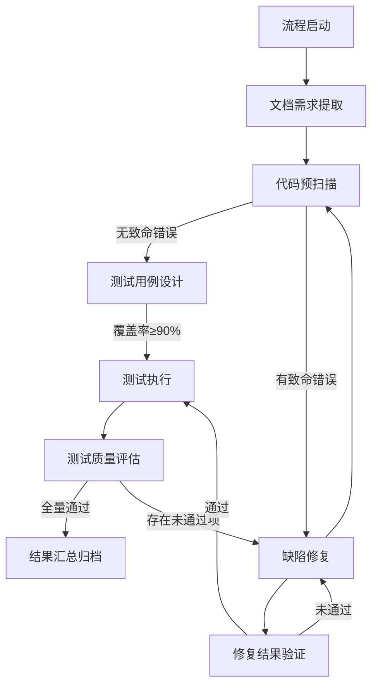

# kilocode-testauto-workflow 全自动功能测试工作流

## 📋 文档概览
本文档详细介绍 `kilocode-testauto` 系列自动化功能测试工作流（基于 kilocode custom_modes 实现），该工作流聚焦**纯功能测试**，以「全自动无人工值守」为核心目标，整合多种测试方法论与原子化任务拆解，覆盖从需求提取、用例设计、测试执行到缺陷修复、结果归档的全链路，确保代码与文档需求的一致性，高效识别并修复编译错误、运行错误、模块错误及功能错误。

## 开源&版权
- 开源作者: zengfr
- 开源协议: Apache-2.0 license

## 🌟 核心特性
### 1. 全流程自动化，零人工干预
- 从流程启动（代码仓库更新/定时触发）到最终报告归档，无需人工介入，自动完成「需求提取→用例设计→测试执行→缺陷修复→验证闭环」
- 支持异常自愈：角色无响应、测试超时、资源过载等场景自动处理，保障流程持续运行至全量测试通过

### 2. 多测试方法深度融合
- 覆盖 **单元测试、集成测试、TDD（红绿蓝流程）、BDD（业务场景导向）、端到端 Mock 测试、网页链接连通性测试、按钮交互测试** 全类型功能测试
- 用例设计适配不同场景：原子化单元测试（Jest/Mocha）、业务流程 Gherkin 语法（Given-When-Then）、Playwright 端到端 Mock 脚本

### 3. 原子化任务拆解，精准高效
- 9个角色分工明确，每个角色聚焦单一核心职责（如「文档需求先行者」仅负责需求提取与补全，「缺陷修复者」仅做最小改动修复）
- 用例设计遵循「单例单验收点」原则，避免冗余，提升执行效率与定位精准度

### 4. 极致效率优化，快速闭环
- 资源复用：闲置浏览器进程、测试环境初始化结果复用，减少重复耗时
- 优先级调度：核心功能→次要功能→异常场景→界面交互，优先保障业务主线测试效率
- 快速验证：修复后仅复测关联用例+核心回归点，10分钟内完成闭环，无需全量重测

### 5. 稳定性与可追溯性双保障
- 异常处理机制：进程超时重启、负载动态均衡、非确定性失败自动重试（2次）
- 全链路可追溯：所有操作关联需求验收点（绑定 SDD 标识），修复记录含「根因+改动点+验证结果」，报告自动归档至代码仓库

### 6. 兼容残缺文档场景
- 支持从碎片化/不完整文档中提取显性需求，结合行业常识补全隐性需求与边界条件
- 无法从文档获取的需求项，自动标记并通过代码反推，避免需求遗漏

## 🛠️ 功能模块全景
| 角色 Slug                          | 角色名称                | 核心定位                | 核心职责                                                                 | 关键输出物                                  |
|------------------------------------|-------------------------|-------------------------|--------------------------------------------------------------------------|---------------------------------------------|
| testauto-auto-test-commander       | 自动化测试总指挥        | 全流程大脑              | 角色任务分配、进度监控、异常处理、流转规则管控                           | 流程调度日志、角色任务映射表                |
| testauto-doc-requirement-extractor | 文档需求先行者          | 需求翻译官              | 残缺文档解析、需求边界补全、验收标准量化、与代码逻辑交叉验证             | 需求清单、文档缺失报告                      |
| testauto-code-prescan-analyzer     | 代码预扫描分析师        | 基础守门员              | 编译错误检测、依赖缺失分析、运行环境校验                                 | 预扫描报告（致命/警告分级）                 |
| testauto-test-case-designer        | 多维度测试用例设计者    | 用例架构师              | 多测试方法落地、原子化用例设计、覆盖完整性保障                           | 自动化用例集（单元/集成/端到端）、用例-需求映射表 |
| testauto-test-executor             | 全类型测试执行者        | 执行引擎                | 多类型测试并行执行、资源动态分配、链接连通性验证                         | 测试执行报告、链接测试清单                  |
| testauto-test-quality-evaluator    | 测试质量评估者          | 测试校验官              | 覆盖率分析、用例有效性评估、测试盲区识别                                 | 测试质量评估报告、优化清单                  |
| testauto-bug-fixer                 | 功能缺陷修复者          | 精准修复师              | 缺陷根因定位、最小代码改动修复、回归风险控制                             | 代码修复补丁、修复说明                      |
| testauto-fix-validator             | 修复结果验证者          | 快速验证员              | 修复关联用例复测、核心流程回归验证                                       | 修复验证报告（通过/未通过）                 |
| testauto-test-result-documenter    | 测试结果文档者          | 结果整合者              | 全流程数据汇总、结构化报告生成、历史版本对比                             | 全流程测试报告、缺陷知识库                  |

## 🔄 工作流流转逻辑
### 1. 触发条件
- 主动触发：代码仓库提交更新（如 Git Push）
- 定时触发：配置 cron 表达式（如每日凌晨 2 点自动执行）

### 2. 流转步骤（全自动闭环）


### 3. 关键规则
- 优先级控制：核心功能验收点 > 次要功能 > 异常场景 > 界面交互（链接/按钮）
- 方法论管控：TDD 需满足「单元测试先于开发执行」，BDD 需完成场景评审方可进入执行
- 终止条件：所有测试用例通过（需求覆盖率≥95%、代码行覆盖率≥80%）或手动终止（需记录原因）

## 🚀 使用指南
### 前提条件
1. 环境要求：已部署 kilocode ，支持 custom_modes 自定义角色加载
2. 权限配置：工作流需具备代码仓库读写权限、工具调用权限（Jest、Playwright、SonarQube 等）
3. 依赖工具：
   - 代码编译：ESLint、SonarQube（静态扫描）
   - 测试执行：Jest/Mocha（单元测试）、Playwright（端到端/Mock）、Chrome DevTools（网页测试）
   - 文档解析：PDF/Markdown 解析器（支持残缺文档提取）

### 快速启动
1. 部署 custom_modes 配置
   - 将 `testauto` 系列 yaml 文件导入 kilocode 配置，或复制内容到全局目录或项目目录下custom_modes.yaml文件中
   - 重启 kilocode ，加载配置
 
     ```

3. 查看结果
   - 最终报告：自动归档至代码仓库 `docs/testauto-report/` 目录（Markdown 格式，支持直接查看）
   - 缺陷记录：`docs/testauto-report/缺陷知识库.md`（按模块分类，支持后续复用）

### 配置自定义
如需调整工作流参数（如超时时间、覆盖率阈值），可修改对应角色的 `customInstructions` 部分：
```yaml
# 示例：修改测试执行者的超时配置
customInstructions: |
  ## 核心指令
  1. 执行策略
     - 测试超时：单元测试>8分钟、集成测试>20分钟、端到端>40分钟自动终止  # 原配置：5/15/30分钟
```

## 🎯 核心优势
| 对比维度                | 传统测试流程                          | testauto 工作流                          |
|-------------------------|---------------------------------------|------------------------------------------|
| 人工干预                | 需手动设计用例、执行测试、提交报告    | 全流程自动化，零人工介入                  |
| 测试效率                | 全量重测耗时久，修复后验证慢          | 原子化测试+精准复测，核心流程10分钟闭环   |
| 覆盖完整性              | 依赖人工经验，边界场景易遗漏          | 自动补全需求边界，覆盖正常/异常/极端场景  |
| 可追溯性                | 测试结果与需求关联弱，修复记录分散    | 全链路关联需求验收点，修复记录统一归档    |
| 稳定性                  | 人工操作易出错，异常需手动处理        | 自带异常自愈机制，支持7×24小时无人值守    |
| 学习成本                | 需掌握多种测试工具，配置复杂          | 一键部署，无需手动配置工具链              |

### 额外优势
- 适配残缺文档：无需完整需求文档，可通过代码反推未明确需求
- 资源优化：动态调整进程池、复用闲置资源，降低服务器负载
- 方法论落地：强制遵循 TDD/BDD 规范，提升研发测试一体化水平
- 可扩展性：支持新增测试类型（如接口性能测试）或自定义角色

## 📊 测试覆盖范围
| 测试类型                | 适用场景                          | 工具支撑                  |
|-------------------------|-----------------------------------|---------------------------|
| 单元测试                | 独立函数/组件逻辑验证              | Jest、Mocha               |
| 集成测试                | 模块间接口交互验证                | 自定义接口测试脚本        |
| TDD 红绿蓝测试          | 功能开发/重构过程验证              | Jest + 代码编译工具       |
| BDD 业务场景测试        | 核心业务流程（如登录、下单）        | Cucumber + Gherkin        |
| 端到端 Mock 测试        | 前后端联动+外部服务依赖隔离        | Playwright                |
| 网页链接连通性测试      | 网页跳转、接口调用可达性           | Chrome DevTools + Playwright |
| 网页按钮交互测试        | 按钮点击、表单提交、异常操作（重复提交） | Playwright                |
| 编译/运行错误检测       | 代码语法错误、依赖缺失、配置错误    | ESLint、SonarQube、编译工具 |

## ❓ 常见问题（FAQ）
### 1. 流程卡住不推进怎么办？
- 常见原因：① 代码存在致命编译错误（需手动修复后重新触发）；② 工具依赖未安装（检查 Jest/Playwright 等是否正常）


### 2. 测试未通过但缺陷修复者无法定位根因？
- 查看《测试执行报告》中的失败截图/日志，补充手动分析
- 可临时关闭「自动修复」功能，手动修复后提交代码，流程会自动触发复测

### 3. 如何调整测试优先级（如优先测试某模块）？
- 修改 `testauto-auto-test-commander` 的 `customInstructions` 中「优先级调度」部分，调整模块顺序

### 4. 是否支持自定义测试方法（如新增接口测试）？
- 支持扩展：新增角色（如 `testauto-api-tester`），在总指挥的「角色-阶段映射」中添加对应阶段，配置触发条件即可

### 5. 报告生成后如何同步给团队？
- 可配置 WebHook 通知：在 `testauto-test-result-documenter` 的 `customInstructions` 中添加「报告生成后推送至企业微信/Slack」的指令

## 📌 扩展与定制
- 新增测试类型：支持添加接口性能测试、兼容性测试等角色，扩展 `custom_modes` 配置
- 集成第三方工具：可对接 Jira（缺陷自动创建）、Jenkins（CI/CD 联动）、Prometheus（监控测试指标）
- 自定义报告格式：修改 `testauto-test-result-documenter` 的输出模板，支持 HTML/PDF 格式导出

## 📋 版本信息
| 版本   | 更新时间   | 核心更新内容                          |
|--------|------------|---------------------------------------|
| v1.0   | 2025-XX-XX | 初始版本，支持全流程自动化功能测试    |
| v1.1   | 2025-XX-XX | 优化资源复用逻辑，新增报告 WebHook 通知 |
| v1.2   | 2025-XX-XX | 增强残缺文档解析能力，补充异常自愈场景 |

## 🧑💻 维护与支持
- 维护者：自动化测试专家团队
- 问题反馈：提交 Issue 至代码仓库或联系维护团队
- 文档更新：同步更新至代码仓库 `docs/testauto-workflow/README.md`

---

**总结**：`testauto` 工作流通过「自动化、原子化、多方法融合」，彻底解决传统功能测试效率低、覆盖不全、可追溯性差的问题，适用于需要高频次、高质量功能验证的研发场景（如互联网产品迭代、企业级应用开发），支持长期稳定运行，助力团队实现「研发-测试」一体化高效闭环。

## join wechat group
- wechat : youandme10086

|wechat|wechat-group|
|------|----------|
|||